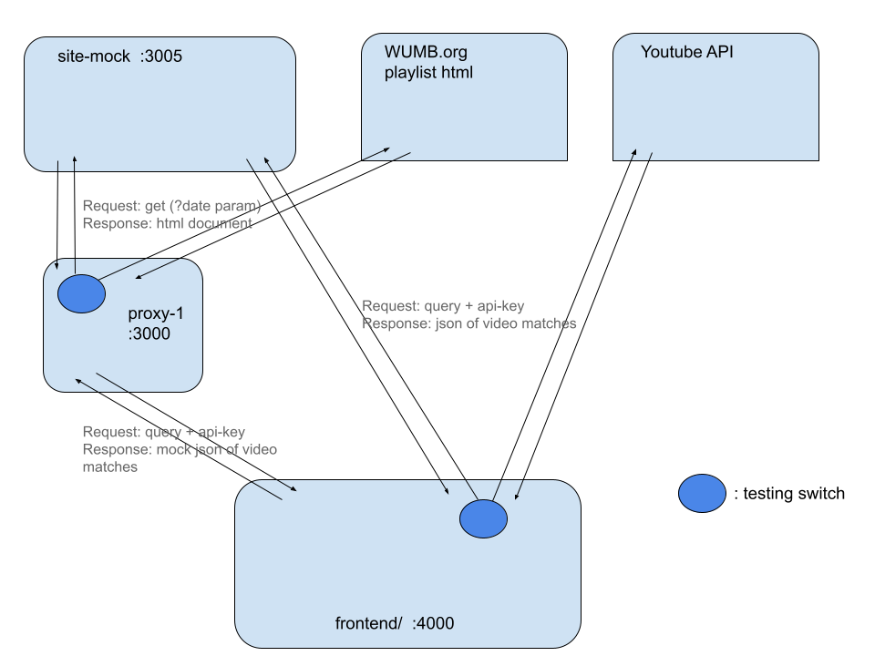

# listen-wumb
Discover and play music curated in this radio station's archives.

### Application

*Development in progress, as of 6.19.2021.*

The components of this application:
 - webscraping from wumb archives
 - using YouTube Data API to find matches to the songs
 - automatically playing songs found on youtube

### Quickstart
**API Key in .env:** add a `.env` file to `frontend/` directory. Inside place the following:

```
YT_KEY=<youtube-data-v3-api-key>
```
This key can be obtained [here.](https://developers.google.com/youtube/v3/getting-started)

**Start servers:** three express servers to run the app:
 - `frontend/` *- port 4000*
 - `proxy-1/`  *-  port 3004*
 - `site-mock/`  *-  port 3005*

You can do this manually (or **TODO** - run the setup script in `misc/utils/`: setup.sh or setup.bat).

**View Page:** Then make a request to frontend to load the page, http://localhost:4000/. 

By default this should use site-mock server to serve wumb-playlist and yt-search mock results. See "Testing Switches" for how to point this to 

### Architecture

v1 architecture:

*Access the diagram [here](https://docs.google.com/drawings/d/1A_ioaQ7K0XIW4GsnEkEQVx_wzUZJVe95PGS_5knNQC4/edit)*

The proxy server allows us to get around CORS-error when fetching the html page from wumb domain.

In v2 arch:

- the proxy server will also make the requests to youtube data api to ensure api-rate limiting and use auth to certify api access.

- a server will store past requests to limit the amount of search-api-requests required to play songs.

### Testing Switches

In order to limit the outgoing requests to wumb.org and to youtube api, we point the requests at `site-mock` instead which will serve back mock data. This will help preserve our Youtube Data API Quota.

**These switches are distributed through the project:**

Point scrape request to site-mock: in `proxy-1/index.js` lines 16-21:
```javascript
app.get("/parse", (req, res) => {
    
    // const url = "http://wumb.org/cgi-bin/playlist1.pl"
    const url = "http://localhost:3005/page"

    fetch(url)
```
Point the youtube api request to the site-mock in `frontend/views/script.hbs` lines 5-20:

```javascript

// configure testing / dev params
bTesting = true
ytMockURL = "http://127.0.0.1:3005/ytmock"
testMaxRows = 5


function searchItem(searchStr) {

    const bLog = false
    const maxResults = 20

    let url = `https://www.googleapis.com/youtube/v3/search`
    if (bTesting) url = ytMockURL
    url    += `?part=snippet&maxResults=${maxResults}`
    url    += `&q=${searchStr}`
    url    += `&type=video&key={{YT_KEY}}`

```
